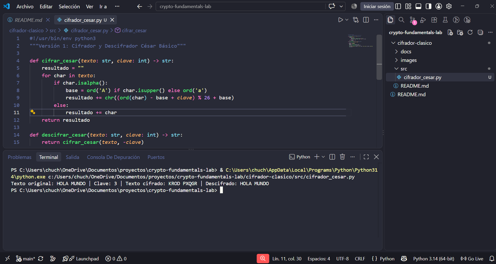
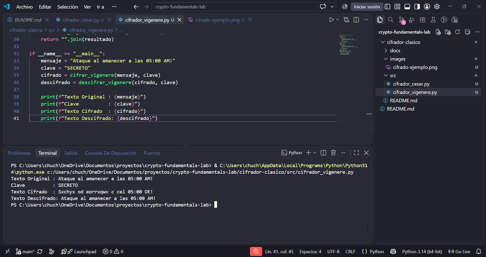

# Cifrador y Descifrador César / Vigenère

### Criptografía clásica | Cifrado simétrico | Manipulación de strings | Python 3

**Autor:** José Jiménez   
**Lenguaje:** Python 3  
**Área:** Criptografía | Fundamentos de seguridad

---

## El Problema

Antes de estudiar AES, RSA o cualquier estándar criptográfico moderno, es necesario
entender por qué existen: cuál es la historia de los cifrados, cómo fallaron y qué
los hizo obsoletos.

Sin implementar un cifrado desde cero, herramientas como OpenSSL o GPG son cajas negras.
Este proyecto elimina esa opacidad.

---

## La Solución

Implementación en Python de los dos cifrados simétricos clásicos más importantes:
el Cifrado César (sustitución monoalfabética) y el Cifrado Vigenère (sustitución
polialfabética). El proyecto incluye tanto el cifrador como el descifrador para cada
algoritmo, y un módulo de análisis de frecuencia para romper César sin conocer la clave.

---

## Aplicación en seguridad

El Cifrado César se usa hoy como ejemplo didáctico en auditorías para demostrar
por qué la complejidad computacional importa. El Vigenère fue considerado "irrompible"
durante siglos — entender por qué falló es entender por qué los cifrados modernos
necesitan confusión y difusión (principios de Shannon, 1945), base teórica de AES.

→ [`docs/practica-cifrador.pdf`](./docs/practica-cifrador.pdf) — Documento completo con teoría y desarrollo paso a paso

---

## Capacidades implementadas

| Función | Descripción |
|---|---|
| Cifrado César | Desplazamiento configurable del 1 al 25 sobre el alfabeto |
| Descifrado César | Reversa exacta del desplazamiento |
| Análisis de frecuencia | Ataque de criptoanálisis para romper César sin la clave |
| Cifrado Vigenère | Sustitución polialfabética con clave de texto |
| Descifrado Vigenère | Requiere conocer la clave exacta |

---

## Versiones del proyecto

Este proyecto fue desarrollado en etapas para reflejar un ciclo de desarrollo real.

### Versión 1 — Cifrado César básico
**Archivo:** `src/cifrador_cesar.py`

Implementación mínima: cifra y descifra un texto recibiendo clave numérica.
Diseñado para entender la lógica de sustitución antes de agregar complejidad.

```bash
python src/cifrador_cesar.py
```




### Versión 2 — Cifrado Vigenère

**Archivo:** `src/cifrador_vigenere.py`


Añade cifrado polialfabético con clave de texto. Incluye validación de entrada

y manejo de caracteres no alfabéticos (espacios, números, puntuación).


```bash

python src/cifrador_vigenere.py

```


**Nuevo en V2:**

- Cifrado con clave de texto de longitud variable

- Descifrado exacto con la misma clave

- Preservación de espacios y caracteres especiales





### Versión 3 — Criptoanálisis: romper César sin la clave

Módulo de análisis de frecuencia que ataca el Cifrado César probando los 25

desplazamientos posibles y evaluando cuál produce texto legible en español/inglés.

```bash

python src/criptoanalis-cesar.py

```


**Nuevo en V3:**

- Ataque de fuerza bruta sobre los 25 posibles desplazamientos

- Ranking de candidatos por frecuencia de letras comunes


---


## Uso


```bash

# Clonar el repo completo

git clone https://github.com/tu-usuario/crypto-fundamentals-lab.git

cd crypto-fundamentals-lab/cifrador-clasico


# Ejecutar el cifrador César

python src/cifrador_cesar.py


# Ejecutar el cifrador Vigenère

python src/cifrador_vigenere.py


# Ejecutar  el criptoanalisis

python src/criptoanalisis-cesar.py

```


Sin dependencias externas — solo Python 3 estándar.


---


## Mejoras planeadas


- **Soporte para ROT13** — variante fija de César usada en foros y ofuscación básica

- **Índice de coincidencia (IC)** — método estadístico para encontrar la longitud de la clave Vigenère

- **Interfaz de argumentos CLI** — pasar texto y clave directamente como parámetros con argparse

- **Exportar resultado a archivo** — guardar salida en `.txt` para uso en reportes


---


## Habilidades demostradas


- Implementación de algoritmos criptográficos desde cero (sin librerías de cifrado)

- Manipulación de strings y aritmética modular en Python

- Pensamiento ofensivo: romper un cifrado además de implementarlo

- Documentación técnica orientada a portafolio profesional


---


## Recursos de referencia


- Kahn, D. (1967). *The Codebreakers* — historia estándar de la criptografía clásica

- Shannon, C. (1949). *Communication Theory of Secrecy Systems* — paper que formalizó por qué estos cifrados fallan


---


*Parte de [`crypto-fundamentals-lab`](../) | Fase 1 del portafolio de ciberseguridad*  

*[Ver todos los proyectos →](https://github.com/jxsewv)*