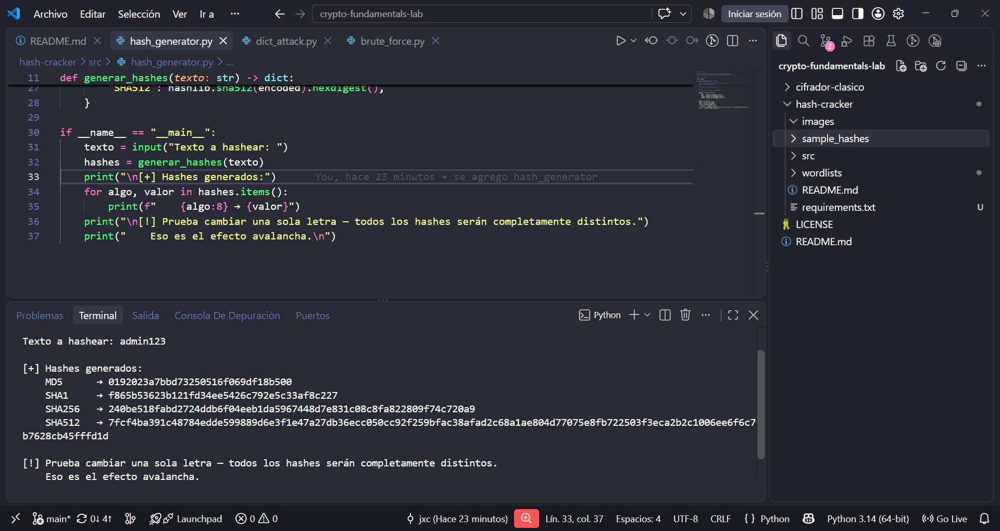
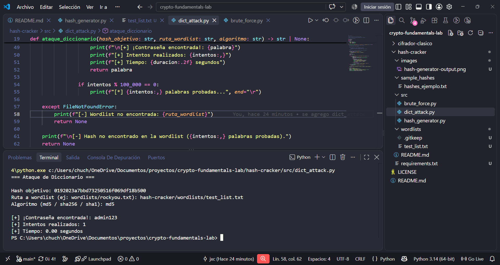
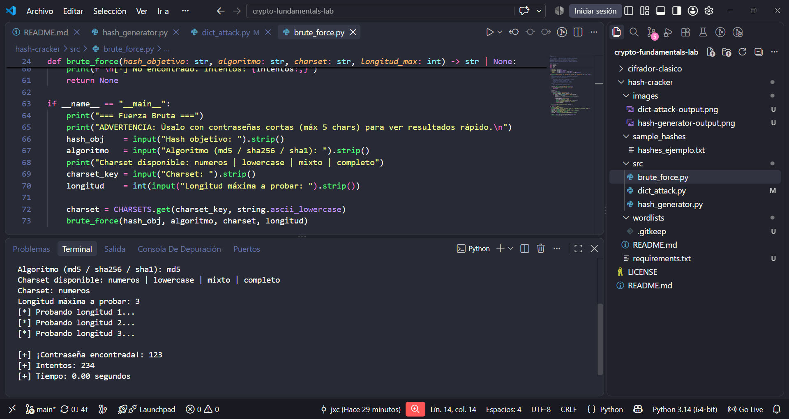

# Hash Extractor y Cracker

### Hashing | Ataques de Diccionario | Fuerza Bruta | Auditoría de Contraseñas | Python 3

**Autor:** Jose Jiménez  
**Lenguaje:** Python 3  
**Área:** Criptografía | Seguridad de credenciales | Fase 1 del roadmap

---

## El Problema

Las bases de datos que almacenan contraseñas en texto plano son una vulnerabilidad
crítica y documentada. Pero la solución más común —almacenar el hash— también falla
cuando la contraseña es débil: herramientas modernas como Hashcat pueden probar
miles de millones de hashes por segundo usando GPU.

Sin entender cómo funciona un ataque de diccionario o de fuerza bruta en la práctica,
es imposible diseñar políticas de contraseñas que realmente resistan auditorías.

---

## La Solución

Tres scripts en Python que cubren el ciclo completo: generar hashes, atacarlos
con diccionario (wordlist RockYou) y atacarlos con fuerza bruta configurable.
Cada script está construido desde cero para entender el mecanismo —sin wrappers,
sin librerías de cracking: solo hashlib y lógica pura.

---

## Aplicación en seguridad

Los ataques de diccionario son el vector más común en brechas de credenciales
corporativas. El reporte Verizon DBIR confirma año tras año que contraseñas débiles
o reutilizadas explican la mayoría de los accesos no autorizados.

Este proyecto demuestra experimentalmente por qué políticas como "mínimo 12 caracteres,
sin palabras del diccionario" existen —y cuánto tiempo tarda en romperse cada variante.

→ [`docs/practica-hash-cracker.pdf`](./docs/practica-hash-cracker.pdf) — Documento completo con teoría y desarrollo

---

## Capacidades implementadas

| Función | Algoritmos soportados | Descripción |
|---|---|---|
| Generador de hashes | MD5, SHA1, SHA256, SHA512 | Demuestra determinismo y efecto avalancha |
| Ataque por diccionario | MD5, SHA1, SHA256 | Itera wordlist hasta encontrar coincidencia |
| Fuerza bruta | MD5, SHA1, SHA256 | Genera todas las combinaciones hasta longitud N |

---

## Versiones del proyecto

### Versión 1 — Generador y comparador de hashes
**Archivo:** `src/hash_generator.py`

Genera hashes de cualquier texto en 4 algoritmos simultáneos.
Diseñado para observar el efecto avalancha: cambiar una sola letra
produce un hash completamente distinto.

```bash
python src/hash_generator.py
```

**Output de ejemplo:**

Texto a hashear: hola

[+] Hashes generados: MD5 → 4d186321c1a7f0f354b297e8914ab240 SHA1 → 99800b85d3383e3a2fb45eb7d0066a4879a9dad0 SHA256 → b221d9dbb083a7f33428d7c2a3c3198ae925614d70210e28716ccaa7cd4ddb79 SHA512 → [hash largo...]

[!] Prueba cambiar una sola letra — todos los hashes serán completamente distintos. Eso es el efecto avalancha.




---

### Versión 2 — Ataque por diccionario
**Archivo:** `src/dict_attack.py`

Itera sobre cada palabra de una wordlist, la hashea y la compara
contra el hash objetivo. Muestra en tiempo real cuántas palabras
se prueban por segundo y cuánto tardó en encontrar la contraseña.

```bash
python src/dict_attack.py
```

**Nuevo en V2:**
- Soporte para MD5, SHA1 y SHA256 configurable en runtime
- Contador de progreso cada 100,000 palabras
- Tiempo total y número de intentos al encontrar la contraseña



---

### Versión 3 — Fuerza bruta configurable
**Archivo:** `src/brute_force.py`

Genera todas las combinaciones posibles de un charset definido
hasta una longitud máxima. Diseñado para demostrar en vivo
el crecimiento exponencial del espacio de búsqueda.

```bash
python src/brute_force.py
```

**Nuevo en V3:**
- Charset configurable: solo números / solo lowercase / mixto / completo
- Longitud máxima configurable
- Muestra el tiempo real por longitud para visualizar la explosión combinatoria



**Observación clave:** Una contraseña de 4 dígitos (`charset=numeros, longitud=4`)
se rompe en milisegundos. Una contraseña de 6 caracteres mixtos tarda minutos.
Una de 8 caracteres completos: horas o días. Esto es el argumento empírico para
cualquier política de contraseñas.

---

## Cómo obtener la wordlist (RockYou)

Las wordlists no se incluyen en el repositorio por tamaño (RockYou.txt = ~133 MB).

```bash
# En Kali Linux o Parrot OS ya viene incluida:
ls /usr/share/wordlists/rockyou.txt

# En otras distros, descargar desde:
# https://github.com/brannondorsey/naive-hashcat/releases/download/data/rockyou.txt
# o instalar con: sudo apt install wordlists

# Descomprimirla si viene en .gz:
gunzip /usr/share/wordlists/rockyou.txt.gz
```

---

## Uso completo

```bash
# Clonar el repo
git clone https://github.com/tu-usuario/crypto-fundamentals-lab.git
cd crypto-fundamentals-lab/hash-cracker

# V1: Generar hashes de un texto
python src/hash_generator.py

# V2: Atacar un hash con diccionario
# (coloca tu wordlist en wordlists/rockyou.txt primero)
python src/dict_attack.py

# V3: Fuerza bruta — úsalo con contraseñas de máx 5 chars para ver resultados rápido
python src/brute_force.py
```

**Hashes de práctica incluidos** en [`sample_hashes/hashes_ejemplo.txt`](./sample_hashes/hashes_ejemplo.txt) —
contraseñas deliberadamente débiles y conocidas para probar los scripts sin riesgo.

---

## Diferencia práctica: diccionario vs. fuerza bruta

| Método | Velocidad | Cobertura | Cuándo usarlo |
|---|---|---|---|
| Diccionario | Muy rápido | Solo palabras conocidas | Contraseñas reales de usuarios (casi siempre están en listas) |
| Fuerza bruta | Exponencialmente más lento | Cualquier combinación posible | Contraseñas cortas o cuando el diccionario falló |

En un escenario real de auditoría: primero diccionario, después fuerza bruta si no funciona.

---

## Mejoras planeadas

- **Salting:** demostrar por qué un hash con salt resiste diccionarios aunque la contraseña sea débil
- **Ataque híbrido:** combinar palabras del diccionario con variaciones numéricas (`password` → `password123`)
- **Soporte bcrypt / Argon2:** los algoritmos de hashing modernos diseñados *específicamente* para contraseñas
- **Exportar resultados a JSON:** salida estructurada para incluir directamente en reportes de auditoría

---

## Habilidades demostradas

- Implementación de ataques criptográficos sin librerías especializadas
- Comprensión de la diferencia práctica entre cifrado y hashing
- Uso de `itertools` para generación eficiente de espacio de búsqueda
- Medición empírica del costo computacional de distintas políticas de contraseñas
- Manejo de wordlists y archivos grandes con lectura de flujo (sin cargar en memoria)

---

*Parte de [`crypto-fundamentals-lab`](../) · Proyecto 2 de 15 · Fase 1 — Fundamentos*  
*Proyecto anterior: [Cifrador César / Vigenère](../cifrador-clasico/) ·
Proyecto siguiente: [Verificador de Integridad](../file-integrity-monitor/)*